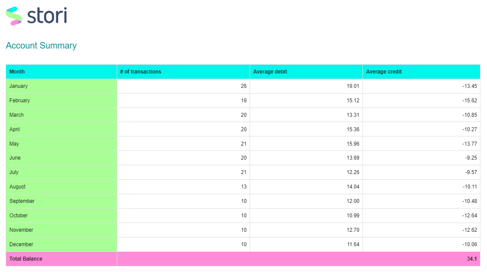
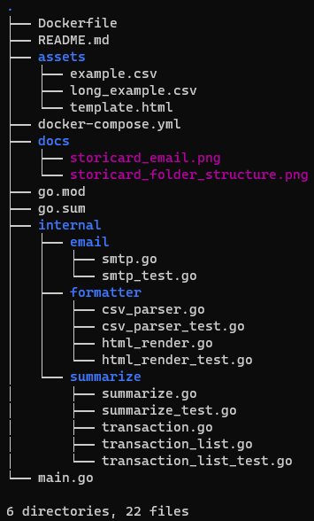

# Stori Card Challenge #

This repository contains a Golang 1.20 executable that reads a transaction file in csv format, generates the summary of transactions by month and sends it as an email via SMTP.

## Install

Create a .env file following the example below

```
SMTP_USERNAME=
SMTP_PASSWORD=
SMTP_HOST=
SMTP_PORT=
```

Set the enviroment variables in the docker-compose.yml file following the example below

```
CSV_FILE_NAME: long_example.csv
TEMPLATE_NAME: template.html
EMAIL_SUBJECT: Transaction History
EMAIL_FROM:
EMAIL_TO:
```

Make sure you are using Docker Compose

```
docker-compose . up
```

## Tech Stack

* ***net/smtp***
Golang standard library including functions for sending email over SMTP

* ***encoding/csv***
Golang standard library including functions for parsing CSV files

* ***html/template***
Golang standard library including functions for generating HTML output

* ***github.com/stretchr/testify***
Golang package including functions for unit testing

## Development Approach
The code reads the environment variables to obtain the SMTP credentials and the content of the email.
After that, it reads the specified csv file, and parses it as a list of transactions.
A summary is generated from the transaction list and the HTML content is rendered from the template and summary.
Finally, the email is sent via SMTP.

## Email example


## Folder structure
